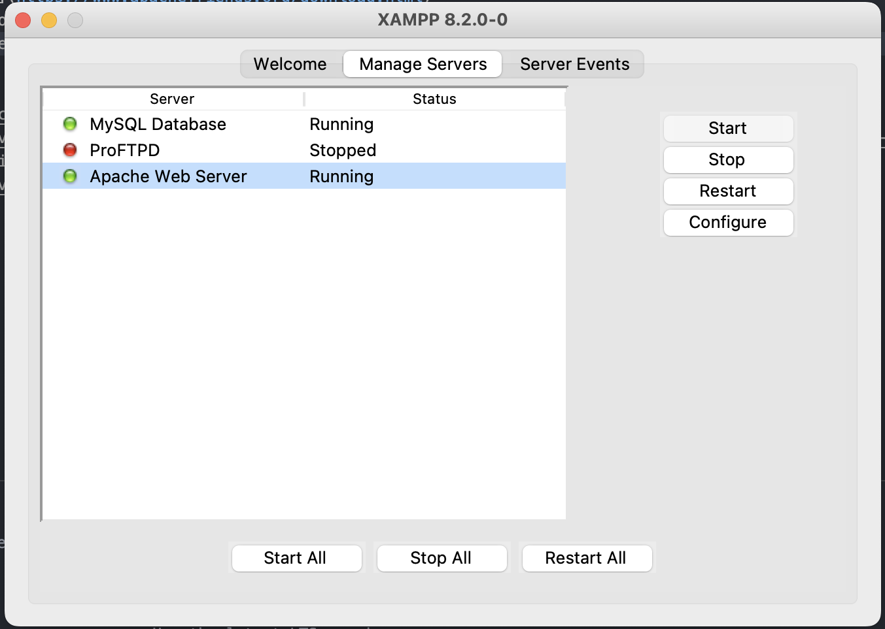
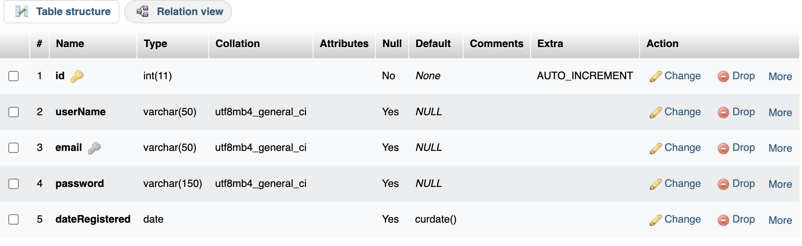

# Bare Bones Node.js / React App

This is a Node.js app with authentication that serves up a React app created with create-react-app on the front end

You will notice that the front end has no style or validation or error handling or UX features like clearing the input fields on submission. Those are meant to be added by a developer according to their needs.

This app simply allows the user to create an account, access a protected route, make an API call that requires authorization and log out.

The idea is that almost every app requires authentication. With this starter code a developer is free to create the rest of their React app and not have to write authentication from scratch and handle tokens on the front end.

## Backend Features:

- Express router
- MySQL database
- Separation of concerns for routes, error handling and CRUD operations
- Custom error class that works differently for development and production
- User info validation with joi
- Passwords encrypted with bcrypt
- Serves the front end on the same port as the server

## Frontend Features

- Created with '**npx create-react-app**'
- Single page application with React Router
- JWT is saved in **httpOnly**, **secure** cookie to prevent XSS attacks and keep the user signed in even if they refresh the page

## How to run

- Install [Node.js](https://nodejs.org/en) if you don't already have it
- Install [Postman](https://www.postman.com/) if you don't already have it
- Install [XAMPP](https://www.apachefriends.org/download.html)
- Clone this repo and run '**npm i**' in both **server** and **client** folders
- Run XAMPP, select the **Manage Servers** tab and start both **MySQL Database** and **Apache Web Server**
- In your browser go to [http://localhost/phpmyadmin](http://localhost/phpmyadmin) to open the admin panel

  

- **NOTE:** if MySQL Database is not starting, it's probably because something else is running MySQL on your machine, such as MySQL Workbench. Open your Activity Monitor / Task Manager, close any tasks under the name "mysql" and try again
- **NOTE:** if http://localhost/phpmyadmin is not working it's probably because you did not run Apache Web Server. I do this all the time!
- From the terminal cd into the **server** folder and run '**touch .env**' and add the following to the newly created **.env** file:

```
APP_PORT=3030
DB_PORT=3306
DB_HOST=localhost
DB_USER=root
DB_PASS=
MYSQL_DB=testdb
JWT_KEY="shhhhhhhhhsecret"
NODE_ENV=dev
```

- Change the value for JWT_KEY to something more unique
- From the terminal cd into the **server** folder and run '**npm start**'
- In **app.js** you will find some commented out code under ////ONLY RUN THIS ONCE AND THEN DELETE. Uncomment this code
- In Postman make a GET request to localhost:3030/createdb and then another GET request to localhost:3030/createregistration. This will create the database for your project and the table to store user info
- Alternatively, you can create the database and the table in phpMyAdmin with the following structure:
  
- You can now delete the code that was previously commented out
- If all worked out fine, you should be able to go to [http://localhost:3030/home](http://localhost:3030/home) in your browser and see the very basic React app

## Credit Where Credit is Due:

- Most of the backend code comes from the [Build RESTful APIs with Node.js express and MySQL | Authentication with JWT](https://www.youtube.com/watch?v=WfCJ3sHnLBM&t=97s) tutorial by Technical Babaji. It's the most helpful tutorial on Node.js I've ever seen. Watch the video and other videos related to this RESTful API
- The front end borrows heavily from [React Persistent User Login Authentication with JWT Tokens](https://www.youtube.com/watch?v=27KeYk-5vJw) by Dave Gray. I also recommend watching the rest of the videos in the series. One key difference is that my project does not store the JWT in the context
- [Understanding Cookies and Implementing them in Node.js](https://www.section.io/engineering-education/what-are-cookies-nodejs/) really helped me figure out how to create and delete httpOnly, secure cookies. You will not believe how many articles I've read that did not have the actual code. One note, however, make sure you set **maxAge** to something more than 5000. That value is in milliseconds!
- [Deploy a React app with Node.js](https://medium.com/@achillesmoraites/serve-a-react-app-with-express-server-c5986769bac) - pretty much the exact steps I followed to make the Node application serve up the React front end on the same port.
